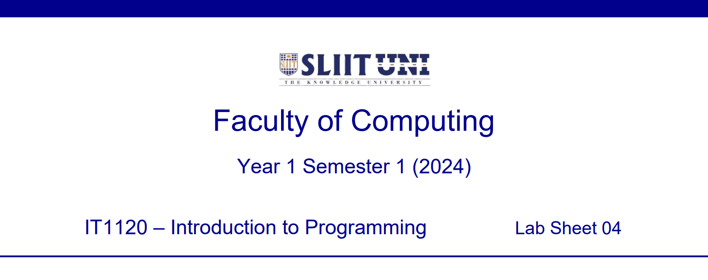
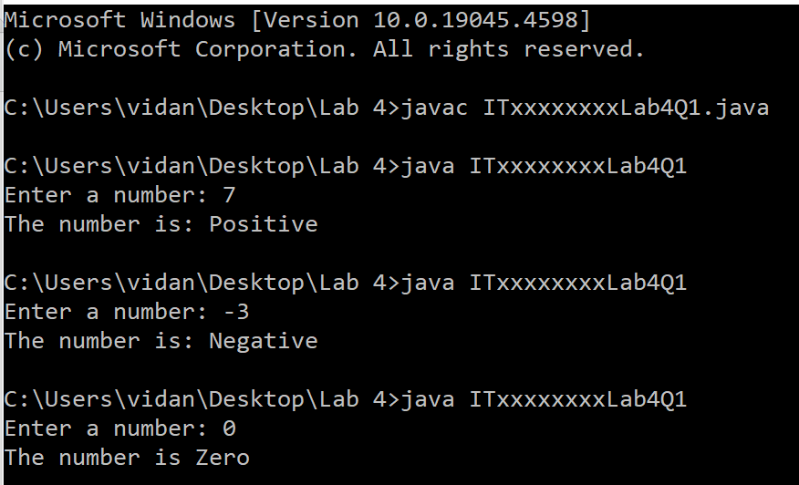
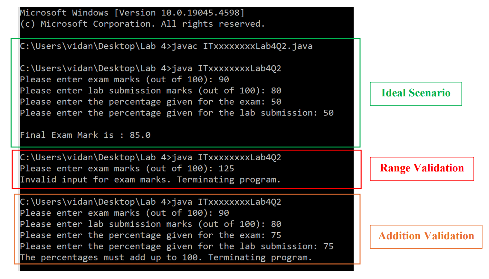
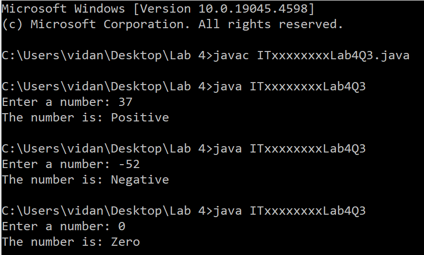

  

    
  

### Question 1 (Tutorial 3 -- Q3)

Write a Java program to input a number from the keyboard and display
whether it is Positive or Negative. If user input 0, display number is
Zero.

Save the file inside '**Lab 4**' folder as: **ITxxxxxxxxLab4Q1.java**

Replace 'ITxx xxx xxx' of the filename, with your own Student ID.

Expected Output:

  

    
  

### Question 2 (Tutorial 3 -- Q4)

Final mark of a module is calculated by considering two components, exam
marks and lab submission marks. The percentages taken from each
component as the final mark.

Write a Java program to:

-   Input the exam marks (given out of 100) and the lab submission marks
    (given out of 100) from the keyboard

-   Validate the entered marks (should be greater than or equal to 0 and
    less than or equal to 100)

-   Input the percentage taken from the exam mark and the lab submission
    mark from the keyboard

-   Validate the values (entered percentages should add to 100)

-   Calculate the final exam marks

Save the file inside '**Lab 4**' folder as: **ITxxxxxxxxLab4Q2.java**

Replace 'ITxx xxx xxx' of the filename, with your own Student ID.

Expected Output:

  

    
  

### Question 3 

Write a Java program to Q1 using **[Ternary Operator](?
:)** to check if the number is Positive or Negative or Zero.

Save the file inside '**Lab 4**' folder as: **ITxxxxxxxxLab4Q3.java**

Replace 'ITxx xxx xxx' of the filename, with your own Student ID.

Expected Output:

  

    
  

  

    
  

