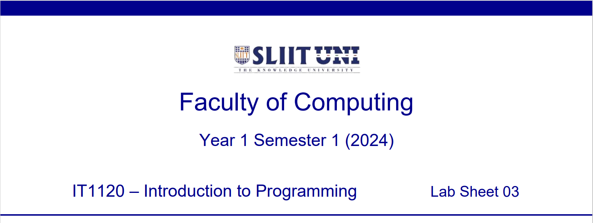

  

    
  

### Question 1A (Tutorial 2 -- Q2)

Enter the price of 1kg of rice and the number of kilograms you want to
buy from the keyboard. Write a Java program to find the amount you have
to pay.

Save the file inside '**Lab 3**' folder as: **ITxxxxxxxxLab3Q1A.java**

Replace 'ITxx xxx xxx' of the filename, with your own Student ID.

Expected Output:

  

    
  

### Question 1B (Tutorial 2 -- Q2)

The supermarket is giving a 10% discount on the total bill.

Modify the Java program and find the amount you have to pay after
considering the discount.

Save the file inside '**Lab 3**' folder as: **ITxxxxxxxxLab3Q1B.java**

Replace 'ITxx xxx xxx' of the filename, with your own Student ID.

Expected Output:

  

    
  

### Question 2 (Tutorial 2 -- Q3)

An employee is paid an additional amount to his monthly salary as OT
amount.

Write a Java program to input the monthly salary, number of OT hours and
OT hourly rate from the keyboard to find the total salary.

*OT Amount = OT hours \* OT Hourly Rate*

*Total Salary = Monthly Salary + OT Amount*

Save the file inside '**Lab 3**' folder as: **ITxxxxxxxxLab3Q2.java**

Replace 'ITxx xxx xxx' of the filename, with your own Student ID.

Expected Output:

  

    
  

### Question 3 (Tutorial 2 -- Q4)

Write a Java program to enter a rupee amount and print the number of
5000/=, 1000/=, 500/=, 200/=, 100/=, 50/=, 20/=, 10/=, 5/=, 2/=, 1/=
notes and coins in that amount.

e.g. Amount = 2754

Your program should print

5000 Notes -- 0

1000 Notes -- 2

500 Notes -- 1

200 Notes -- 1

100 Notes -- 0

50 Notes -- 1

20 Notes -- 0

10 Coins -- 0

05 Coins -- 0

02 Coins -- 2

01 Coins -- 0

Save the file inside '**Lab 3**' folder as: **ITxxxxxxxxLab3Q3.java**

Replace 'ITxx xxx xxx' of the filename, with your own Student ID.

Expected Output:

  

    
  

  
### Question 4 

Write a Java program that inputs a five-digit number, separates the
number into its individual digits and prints the digits separated from
one another by a space.

e.g: Input 52348

Output 5 2 3 4 8

Save the file inside '**Lab 3**' folder as: **ITxxxxxxxxLab3Q4.java**

Replace 'ITxx xxx xxx' of the filename, with your own Student ID.

Expected Output:

  

    
  

  

    
  

